We used the beer and breweries data set to explore the provided questions involving breweries per state, missing values, ABV vs IBU, etc. Additionally, we developed a model to predict if a beer is an IPA or Ale. Finally, we analyzed the data deeper to look for unique trends.  


```r
library(tidyr)
library(dplyr)
```

```
## 
## Attaching package: 'dplyr'
```

```
## The following objects are masked from 'package:stats':
## 
##     filter, lag
```

```
## The following objects are masked from 'package:base':
## 
##     intersect, setdiff, setequal, union
```

```r
library(ggplot2)
library(maps)
library(class)
library(caret)
```

```
## Loading required package: lattice
```

```r
library(e1071)
library(stringr)
library(tidygeocoder)
```

```
## Warning: package 'tidygeocoder' was built under R version 4.0.4
```

Data Import

```r
df_brew <- read.csv(file = file.path('Data_Files', 'Breweries.csv'), header = TRUE)
df_beer <- read.csv(file = file.path('Data_Files', 'Beers.csv'), header = TRUE)
```

First, look at the two data sets we will be using. 

```r
head(df_brew)
```

```
##   Brew_ID                      Name          City State
## 1       1        NorthGate Brewing    Minneapolis    MN
## 2       2 Against the Grain Brewery    Louisville    KY
## 3       3  Jack's Abby Craft Lagers    Framingham    MA
## 4       4 Mike Hess Brewing Company     San Diego    CA
## 5       5   Fort Point Beer Company San Francisco    CA
## 6       6     COAST Brewing Company    Charleston    SC
```

```r
head(df_beer)
```

```
##                  Name Beer_ID   ABV IBU Brewery_id
## 1            Pub Beer    1436 0.050  NA        409
## 2         Devil's Cup    2265 0.066  NA        178
## 3 Rise of the Phoenix    2264 0.071  NA        178
## 4            Sinister    2263 0.090  NA        178
## 5       Sex and Candy    2262 0.075  NA        178
## 6        Black Exodus    2261 0.077  NA        178
##                            Style Ounces
## 1            American Pale Lager     12
## 2        American Pale Ale (APA)     12
## 3                   American IPA     12
## 4 American Double / Imperial IPA     12
## 5                   American IPA     12
## 6                  Oatmeal Stout     12
```
Brew_ID represents the unique ID of a particular brewery.
Beer_ID represents the unique ID of a particular beer.


# How many breweries are present in each state?
Let's see the number of states in the data set and confirm entries look correct.

```r
sort(df_brew$State) %>% unique()
```

```
##  [1] " AK" " AL" " AR" " AZ" " CA" " CO" " CT" " DC" " DE" " FL" " GA" " HI"
## [13] " IA" " ID" " IL" " IN" " KS" " KY" " LA" " MA" " MD" " ME" " MI" " MN"
## [25] " MO" " MS" " MT" " NC" " ND" " NE" " NH" " NJ" " NM" " NV" " NY" " OH"
## [37] " OK" " OR" " PA" " RI" " SC" " SD" " TN" " TX" " UT" " VA" " VT" " WA"
## [49] " WI" " WV" " WY"
```

```r
table(df_brew$State)
```

```
## 
##  AK  AL  AR  AZ  CA  CO  CT  DC  DE  FL  GA  HI  IA  ID  IL  IN  KS  KY  LA  MA 
##   7   3   2  11  39  47   8   1   2  15   7   4   5   5  18  22   3   4   5  23 
##  MD  ME  MI  MN  MO  MS  MT  NC  ND  NE  NH  NJ  NM  NV  NY  OH  OK  OR  PA  RI 
##   7   9  32  12   9   2   9  19   1   5   3   3   4   2  16  15   6  29  25   5 
##  SC  SD  TN  TX  UT  VA  VT  WA  WI  WV  WY 
##   4   1   3  28   4  16  10  23  20   1   4
```
All 50 states plus DC are found. The table above presents the number of craft breweries in each state.


```r
# First, get the data to map all the US states and DC with latitude and longitude coordinates (each state will be named with its full name in lower case)
all_us_states <- map_data("state")

# Then, create a mapping of each state name in lower case to its 2-letter abbreviation
states_mapping <- tibble(state = tolower(state.name)) %>%
  bind_cols(tibble(abb = state.abb)) %>%
  bind_rows(tibble(state = "district of columbia", abb = "DC"))
states_mapping <- states_mapping %>% rename(region = state)

# Get the number of breweries in each state
breweries_by_state<- df_brew %>% group_by(State) %>% tally()
breweries_by_state <- breweries_by_state %>% mutate(State = str_trim(State)) # Trimming white spaces in the State column
breweries_by_state <- breweries_by_state %>% rename(abb = State)

# Join the data frames to be able to plot the data
breweries_by_state_with_abb <- inner_join(x = states_mapping, y = breweries_by_state, by = "abb")
breweries_map <- inner_join(all_us_states, breweries_by_state_with_abb, by = "region")

ggplot() + geom_polygon( data=breweries_map, aes(x=long, y=lat, group=group, fill = n), color="white", size = 0.2) +
  scale_fill_continuous(name="Breweries", low = "lightpink1", high = "red4",limits = c(0,50), breaks=c(10,20,30,40), na.value = "darkgrey") +
  labs(title="Number of Breweries in Each State", x = "Longitude", y = "Latitude")
```

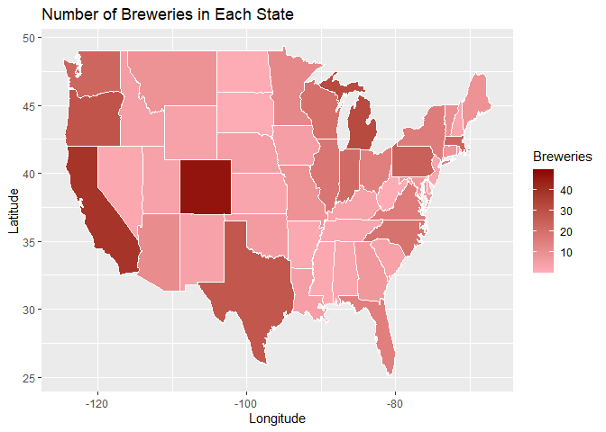<!-- -->

The map above shows the number of craft breweries in each state (states with more breweries have a darker shade of red).

Below is a plot of breweries by state

```r
# To order the bar graph by high to low values, we first need to create a new df with the counts by states
tally <- df_brew %>% group_by(State) %>% tally()
tally <- tally[with(tally, order(n)),]

ggplot(data = tally, mapping = aes(x = reorder(State, -n), n)) + 
  geom_bar(stat = "identity", fill = "red") + 
  theme(axis.text.x = element_text(vjust = grid::unit(c(-2, 0, 2), "points"))) + theme(axis.text.x=element_text(colour="black")) +
  labs(x = " ", y = "Number of Breweries", title = "Breweries by State")
```

```
## Warning: Vectorized input to `element_text()` is not officially supported.
## Results may be unexpected or may change in future versions of ggplot2.
```

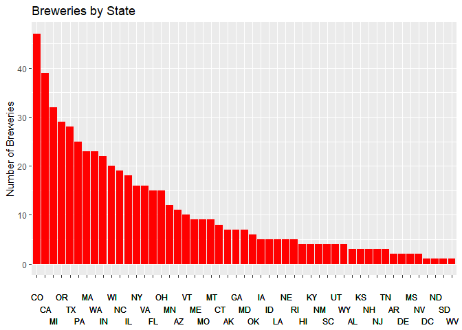<!-- -->

# Merge beer data with the breweries data. Print the first 6 observations and the last six observations to check the merged file.  (RMD only, this does not need to be included in the presentation or the deck.)

```r
df <- merge(x = df_beer, y = df_brew, by.x = "Brewery_id", by.y = "Brew_ID")
df <- df %>% rename(Brewery_ID = 1, Beer_Name = 2, Brewery_Name = 8, State = 10)
head(df, 6) # First 6 observations
```

```
##   Brewery_ID     Beer_Name Beer_ID   ABV IBU
## 1          1  Get Together    2692 0.045  50
## 2          1 Maggie's Leap    2691 0.049  26
## 3          1    Wall's End    2690 0.048  19
## 4          1       Pumpion    2689 0.060  38
## 5          1    Stronghold    2688 0.060  25
## 6          1   Parapet ESB    2687 0.056  47
##                                 Style Ounces       Brewery_Name        City
## 1                        American IPA     16 NorthGate Brewing  Minneapolis
## 2                  Milk / Sweet Stout     16 NorthGate Brewing  Minneapolis
## 3                   English Brown Ale     16 NorthGate Brewing  Minneapolis
## 4                         Pumpkin Ale     16 NorthGate Brewing  Minneapolis
## 5                     American Porter     16 NorthGate Brewing  Minneapolis
## 6 Extra Special / Strong Bitter (ESB)     16 NorthGate Brewing  Minneapolis
##   State
## 1    MN
## 2    MN
## 3    MN
## 4    MN
## 5    MN
## 6    MN
```

```r
tail(df, 6) # Last 6 observations
```

```
##      Brewery_ID                 Beer_Name Beer_ID   ABV IBU
## 2405        556             Pilsner Ukiah      98 0.055  NA
## 2406        557  Heinnieweisse Weissebier      52 0.049  NA
## 2407        557           Snapperhead IPA      51 0.068  NA
## 2408        557         Moo Thunder Stout      50 0.049  NA
## 2409        557         Porkslap Pale Ale      49 0.043  NA
## 2410        558 Urban Wilderness Pale Ale      30 0.049  NA
##                        Style Ounces                  Brewery_Name          City
## 2405         German Pilsener     12         Ukiah Brewing Company         Ukiah
## 2406              Hefeweizen     12       Butternuts Beer and Ale Garrattsville
## 2407            American IPA     12       Butternuts Beer and Ale Garrattsville
## 2408      Milk / Sweet Stout     12       Butternuts Beer and Ale Garrattsville
## 2409 American Pale Ale (APA)     12       Butternuts Beer and Ale Garrattsville
## 2410        English Pale Ale     12 Sleeping Lady Brewing Company     Anchorage
##      State
## 2405    CA
## 2406    NY
## 2407    NY
## 2408    NY
## 2409    NY
## 2410    AK
```
# Address the missing values in each column.

First, we will view the structure of the data frame and then find null values using "summary"

```r
str(df)
```

```
## 'data.frame':	2410 obs. of  10 variables:
##  $ Brewery_ID  : int  1 1 1 1 1 1 2 2 2 2 ...
##  $ Beer_Name   : chr  "Get Together" "Maggie's Leap" "Wall's End" "Pumpion" ...
##  $ Beer_ID     : int  2692 2691 2690 2689 2688 2687 2686 2685 2684 2683 ...
##  $ ABV         : num  0.045 0.049 0.048 0.06 0.06 0.056 0.08 0.125 0.077 0.042 ...
##  $ IBU         : int  50 26 19 38 25 47 68 80 25 42 ...
##  $ Style       : chr  "American IPA" "Milk / Sweet Stout" "English Brown Ale" "Pumpkin Ale" ...
##  $ Ounces      : num  16 16 16 16 16 16 16 16 16 16 ...
##  $ Brewery_Name: chr  "NorthGate Brewing " "NorthGate Brewing " "NorthGate Brewing " "NorthGate Brewing " ...
##  $ City        : chr  "Minneapolis" "Minneapolis" "Minneapolis" "Minneapolis" ...
##  $ State       : chr  " MN" " MN" " MN" " MN" ...
```

```r
summary(df)
```

```
##    Brewery_ID     Beer_Name            Beer_ID            ABV         
##  Min.   :  1.0   Length:2410        Min.   :   1.0   Min.   :0.00100  
##  1st Qu.: 94.0   Class :character   1st Qu.: 808.2   1st Qu.:0.05000  
##  Median :206.0   Mode  :character   Median :1453.5   Median :0.05600  
##  Mean   :232.7                      Mean   :1431.1   Mean   :0.05977  
##  3rd Qu.:367.0                      3rd Qu.:2075.8   3rd Qu.:0.06700  
##  Max.   :558.0                      Max.   :2692.0   Max.   :0.12800  
##                                                      NA's   :62       
##       IBU            Style               Ounces      Brewery_Name      
##  Min.   :  4.00   Length:2410        Min.   : 8.40   Length:2410       
##  1st Qu.: 21.00   Class :character   1st Qu.:12.00   Class :character  
##  Median : 35.00   Mode  :character   Median :12.00   Mode  :character  
##  Mean   : 42.71                      Mean   :13.59                     
##  3rd Qu.: 64.00                      3rd Qu.:16.00                     
##  Max.   :138.00                      Max.   :32.00                     
##  NA's   :1005                                                          
##      City              State          
##  Length:2410        Length:2410       
##  Class :character   Class :character  
##  Mode  :character   Mode  :character  
##                                       
##                                       
##                                       
## 
```
There are 2410 total rows, with 62 nulls in ABV and 1005 in IBU. Some nulls in IBU can be explained by the style (e.g. ciders are never rated based off bitterness).

Now, we will check for empty strings that are not null values.

```r
sum(df$Beer_Name == "")
```

```
## [1] 0
```

```r
sum(df$Style == "")
```

```
## [1] 5
```

```r
sum(df$Beer_Name == "")
```

```
## [1] 0
```

```r
sum(df$Brewery_Name == "")
```

```
## [1] 0
```

```r
sum(df$City == "")
```

```
## [1] 0
```

```r
sum(df$State == "")
```

```
## [1] 0
```
The style column has 5 empty string values.

The code below sorts Beer_Name by the number of characters in its name. By doing this, we also discovered that there are entries that share the same beer name.

```r
data.frame(names=df$Beer_Name,chr=apply(df,2,nchar)[,2]) %>% arrange(chr) %>% head(10)
```

```
##    names chr
## 1     #9   2
## 2     #9   2
## 3    KSA   3
## 4    MCA   3
## 5    IPA   3
## 6    Rad   3
## 7    805   3
## 8    WET   3
## 9    Dad   3
## 10   Zen   3
```

We will investigate how many Beers are listed numerous times along with their number of repeats.

```r
n_occur <- data.frame(table(df$Beer_Name))
n_occur[n_occur$Freq > 1,] %>% arrange(desc(Freq))
```

```
##                                    Var1 Freq
## 1                       Nonstop Hef Hop   12
## 2                       Dale's Pale Ale    6
## 3                           Oktoberfest    6
## 4                Longboard Island Lager    4
## 5                        1327 Pod's ESB    3
## 6                          Boston Lager    3
## 7                      Dagger Falls IPA    3
## 8                                    #9    2
## 9                    312 Urban Pale Ale    2
## 10                  312 Urban Wheat Ale    2
## 11            Angry Orchard Crisp Apple    2
## 12           Barney Flats Oatmeal Stout    2
## 13                         Beach Blonde    2
## 14              Bitter Biker Double IPA    2
## 15                      Blacktop Blonde    2
## 16                               BLAKKR    2
## 17                     Bombshell Blonde    2
## 18                                Boxer    2
## 19                             Brontide    2
## 20                       CAPT Black IPA    2
## 21                                Chaka    2
## 22                       Citra Ass Down    2
## 23                      Clear Creek Ice    2
## 24                     Colorado Red Ale    2
## 25                   Deviant Dale's IPA    2
## 26       Devil's Harvest Extra Pale Ale    2
## 27                  East India Pale Ale    2
## 28                   Fat Tire Amber Ale    2
## 29           Firestarter India Pale Ale    2
## 30             Firewater India Pale Ale    2
## 31                                 Gose    2
## 32                              Grazias    2
## 33                     Green Monsta IPA    2
## 34             Halcyon Unfiltered Wheat    2
## 35                       Hapa Brown Ale    2
## 36                         Heady Topper    2
## 37 Hell or High Watermelon Wheat (2009)    2
## 38         Hop Slayer Double IPA (2011)    2
## 39                           Lake House    2
## 40                      Lazy Daze Lager    2
## 41                      Long Hammer IPA    2
## 42                     Maduro Brown Ale    2
## 43                Main St. Virginia Ale    2
## 44             Mama's Little Yella Pils    2
## 45                         Miner's Gold    2
## 46                      Modus Hoperandi    2
## 47         Morning Wood Wheat (Current)    2
## 48                       Mountain Crest    2
## 49              Narragansett Summer Ale    2
## 50       Northern Lights India Pale Ale    2
## 51                               Oberon    2
## 52                             Old Chub    2
## 53                        One Nut Brown    2
## 54                    oSKAr the G'Rauch    2
## 55                       Our Legacy IPA    2
## 56                         Pale Alement    2
## 57                   Pine Belt Pale Ale    2
## 58                      Plum St. Porter    2
## 59        Point Nude Beach Summer Wheat    2
## 60                    Point Oktoberfest    2
## 61                        Point Special    2
## 62                  Point Special Lager    2
## 63                    Point the Way IPA    2
## 64                           Ranger IPA    2
## 65                           Rye Porter    2
## 66                                Shift    2
## 67               Sierra Nevada Pale Ale    2
## 68                            Slow Ride    2
## 69                        Special Amber    2
## 70   Squatters Full Suspension Pale Ale    2
## 71                       Sunbru Kölsch    2
## 72              Suzy B Dirty Blonde Ale    2
## 73                  TailGate Hefeweizen    2
## 74                         TailGate IPA    2
## 75                       The Brown Note    2
## 76                            The Deuce    2
## 77                   The Imperial Texan    2
## 78                              Torpedo    2
## 79                          Tsunami IPA    2
## 80                       Vanilla Porter    2
## 81                       Watermelon Ale    2
## 82                     White Zombie Ale    2
```
82 Beers are listed multiple times. 75 of which appear twice. One beer is even found 12 times. Let's investigate if/how the columns differ for these repeated beers (e.g. is ABV the same for every Nonstop Hef Hop). Below are several examples of repeated beers. Please note, this is not a complete list of repeated beers.


```r
df %>% filter(Beer_Name == "Nonstop Hef Hop" | Beer_Name == "Dale's Pale Ale" | Beer_Name == "Longboard Island Lager" | Beer_Name == "Devil's Harvest Extra Pale Ale" | Beer_Name == "Point Oktoberfest" | Beer_Name == "The Brown Note")
```

```
##    Brewery_ID                      Beer_Name Beer_ID   ABV IBU
## 1           2                 The Brown Note    2674 0.050  20
## 2          63                 The Brown Note    2539 0.050  20
## 3          81                Nonstop Hef Hop    2400 0.039  20
## 4          81                Nonstop Hef Hop    2399 0.039  20
## 5          81                Nonstop Hef Hop    2398 0.039  20
## 6          81                Nonstop Hef Hop    2397 0.039  20
## 7          81                Nonstop Hef Hop    2396 0.039  20
## 8          81                Nonstop Hef Hop    2395 0.039  20
## 9          81                Nonstop Hef Hop    2394 0.039  20
## 10         81                Nonstop Hef Hop    2393 0.039  20
## 11         81                Nonstop Hef Hop    2392 0.039  20
## 12         81                Nonstop Hef Hop    2391 0.039  20
## 13         81                Nonstop Hef Hop    2390 0.039  20
## 14         81                Nonstop Hef Hop    2389 0.039  20
## 15        132              Point Oktoberfest    1357 0.057  15
## 16        132              Point Oktoberfest     456 0.057  15
## 17        134 Devil's Harvest Extra Pale Ale    2297 0.058  60
## 18        134 Devil's Harvest Extra Pale Ale    1117 0.058  60
## 19        167                Dale's Pale Ale    1444 0.065  65
## 20        167                Dale's Pale Ale    1252 0.065  65
## 21        167                Dale's Pale Ale     955 0.065  65
## 22        167                Dale's Pale Ale       1 0.065  65
## 23        390                Dale's Pale Ale    1166 0.065  65
## 24        390                Dale's Pale Ale    1065 0.065  65
## 25        440         Longboard Island Lager    1274 0.046  18
## 26        440         Longboard Island Lager    1220 0.046  18
## 27        440         Longboard Island Lager    1070 0.046  18
## 28        440         Longboard Island Lager     590 0.046  18
##                         Style Ounces                        Brewery_Name
## 1           English Brown Ale   16.0           Against the Grain Brewery
## 2          American Brown Ale   16.0           Against The Grain Brewery
## 3     American Pale Wheat Ale   16.0              Hopworks Urban Brewery
## 4     American Pale Wheat Ale   16.0              Hopworks Urban Brewery
## 5     American Pale Wheat Ale   16.0              Hopworks Urban Brewery
## 6     American Pale Wheat Ale   16.0              Hopworks Urban Brewery
## 7     American Pale Wheat Ale   16.0              Hopworks Urban Brewery
## 8     American Pale Wheat Ale   16.0              Hopworks Urban Brewery
## 9     American Pale Wheat Ale   16.0              Hopworks Urban Brewery
## 10    American Pale Wheat Ale   16.0              Hopworks Urban Brewery
## 11    American Pale Wheat Ale   16.0              Hopworks Urban Brewery
## 12    American Pale Wheat Ale   16.0              Hopworks Urban Brewery
## 13    American Pale Wheat Ale   16.0              Hopworks Urban Brewery
## 14    American Pale Wheat Ale   16.0              Hopworks Urban Brewery
## 15      Märzen / Oktoberfest   16.0               Stevens Point Brewery
## 16      Märzen / Oktoberfest   12.0               Stevens Point Brewery
## 17    American Pale Ale (APA)   12.0 Southern Prohibition Brewing Com...
## 18    American Pale Ale (APA)   16.0 Southern Prohibition Brewing Com...
## 19    American Pale Ale (APA)   12.0                 Oskar Blues Brewery
## 20    American Pale Ale (APA)   12.0                 Oskar Blues Brewery
## 21    American Pale Ale (APA)   19.2                 Oskar Blues Brewery
## 22    American Pale Ale (APA)   12.0                 Oskar Blues Brewery
## 23    American Pale Ale (APA)   19.2 Oskar Blues Brewery (North Carol...
## 24    American Pale Ale (APA)   12.0 Oskar Blues Brewery (North Carol...
## 25 American Amber / Red Lager   24.0                Kona Brewing Company
## 26 American Amber / Red Lager   16.0                Kona Brewing Company
## 27 American Amber / Red Lager   12.0                Kona Brewing Company
## 28 American Amber / Red Lager   12.0                Kona Brewing Company
##             City State
## 1     Louisville    KY
## 2     Louisville    KY
## 3       Portland    OR
## 4       Portland    OR
## 5       Portland    OR
## 6       Portland    OR
## 7       Portland    OR
## 8       Portland    OR
## 9       Portland    OR
## 10      Portland    OR
## 11      Portland    OR
## 12      Portland    OR
## 13      Portland    OR
## 14      Portland    OR
## 15 Stevens Point    WI
## 16 Stevens Point    WI
## 17   Hattiesburg    MS
## 18   Hattiesburg    MS
## 19      Longmont    CO
## 20      Longmont    CO
## 21      Longmont    CO
## 22      Longmont    CO
## 23       Brevard    NC
## 24       Brevard    NC
## 25          Kona    HI
## 26          Kona    HI
## 27          Kona    HI
## 28          Kona    HI
```
Many repeated beers have identical variables (excluding the unique identifier, Beer_ID). Others, however, have different ounces, brewery_name, city, and state. We decided to keep the repeated beers in the data set, but it does require future investigation.


# Compute the median alcohol content and international bitterness unit for each state. Plot a bar chart to compare.

We will use and update df_clean throughout the file. The purpose of df_clean is to make analyses easier and will often include filtered rows/columns from the main data frame

```r
df_clean <- df %>% group_by(State) %>% summarise(across(c("ABV", "IBU"), ~ median(.x, na.rm = TRUE)))
```

```
## `summarise()` ungrouping output (override with `.groups` argument)
```

```r
df_clean$ABV <- round(df_clean$ABV, 3) * 100
```


```r
df_clean <- df_clean[with(df_clean, order(ABV)),]
ggplot(data = df_clean, mapping = aes(x = reorder(State, -ABV), ABV)) + 
  geom_bar(stat = "identity", fill = "red") + 
  theme(axis.text.x = element_text(vjust = grid::unit(c(-2, 0, 2), "points"))) +
  labs(x = " ", y = "ABV Median", title = "Alcohol Content in Beer by State") + coord_cartesian(ylim=c(3.75,6.25))
```

```
## Warning: Vectorized input to `element_text()` is not officially supported.
## Results may be unexpected or may change in future versions of ggplot2.
```

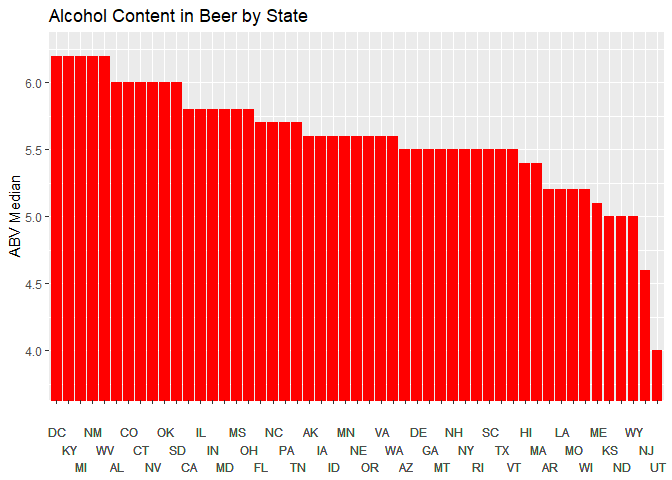<!-- -->

```r
df_clean <- df_clean[with(df_clean, order(IBU)),]
ggplot(data = df_clean, mapping = aes(x = reorder(State, -IBU), IBU)) + 
  geom_bar(stat = "identity", fill = "red") + 
  theme(axis.text.x = element_text(vjust = grid::unit(c(-2, 0, 2), "points"))) +
  labs(x = " ", y = "IBU Median", title = "International Bitterness by State")
```

```
## Warning: Vectorized input to `element_text()` is not officially supported.
## Results may be unexpected or may change in future versions of ggplot2.
```

```
## Warning: Removed 1 rows containing missing values (position_stack).
```

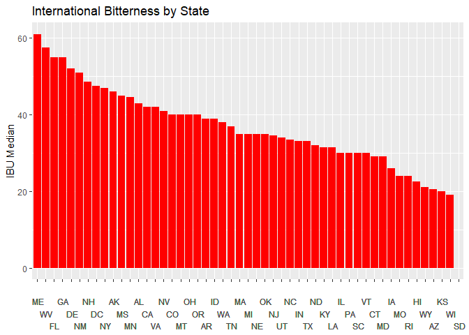<!-- -->


There is a 5 way tie for the highest median ABV.
Maine has the highest IBU, and South Dakota has only null values for their beer IBUs. 

# Which state has the maximum alcoholic (ABV) beer? Which state has the most bitter (IBU) beer?

```r
df[which.max(df$ABV),]
```

```
##     Brewery_ID                                            Beer_Name Beer_ID
## 375         52 Lee Hill Series Vol. 5 - Belgian Style Quadrupel Ale    2565
##       ABV IBU            Style Ounces            Brewery_Name    City State
## 375 0.128  NA Quadrupel (Quad)   19.2 Upslope Brewing Company Boulder    CO
```

```r
df[which.max(df$IBU),]
```

```
##      Brewery_ID                 Beer_Name Beer_ID   ABV IBU
## 1857        375 Bitter Bitch Imperial IPA     980 0.082 138
##                               Style Ounces            Brewery_Name    City
## 1857 American Double / Imperial IPA     12 Astoria Brewing Company Astoria
##      State
## 1857    OR
```
The state that has the maximum alcoholic (ABV) beer is Colorado, and the state that has the the most bitter (IBU) beer is Oregon.

# Comment on the summary statistics and distribution of the ABV variable.

```r
(df$ABV * 100) %>% summary(df$ABV)
```

```
##    Min. 1st Qu.  Median    Mean 3rd Qu.    Max.    NA's 
##   0.100   5.000   5.600   5.977   6.700  12.800      62
```

```r
#4 different bin sizes for histogram:
ggplot(data = df, mapping = aes(x = ABV * 100)) + 
  geom_histogram(fill = "red", bins = 15) + labs(x = "ABV", y = "Frequency", title = "ABV Frequency")
```

```
## Warning: Removed 62 rows containing non-finite values (stat_bin).
```

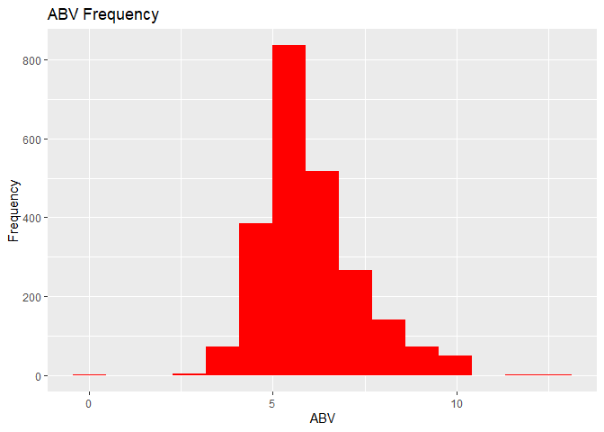<!-- -->

```r
ggplot(data = df, mapping = aes(x = ABV * 100)) + 
  geom_histogram(fill = "red", bins = 25) + labs(x = "ABV", y = "Frequency", title = "ABV Frequency")
```

```
## Warning: Removed 62 rows containing non-finite values (stat_bin).
```

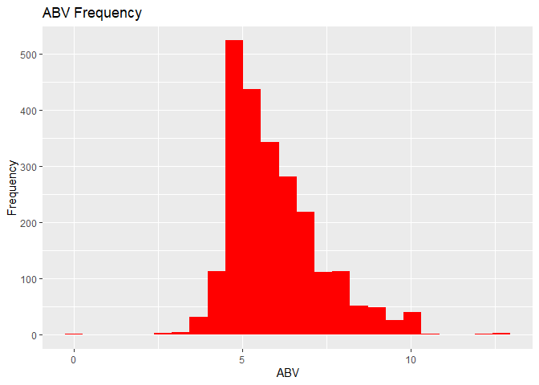<!-- -->

```r
ggplot(data = df, mapping = aes(x = ABV * 100)) + 
  geom_histogram(fill = "red", bins = 50) + labs(x = "ABV", y = "Frequency", title = "ABV Frequency")
```

```
## Warning: Removed 62 rows containing non-finite values (stat_bin).
```

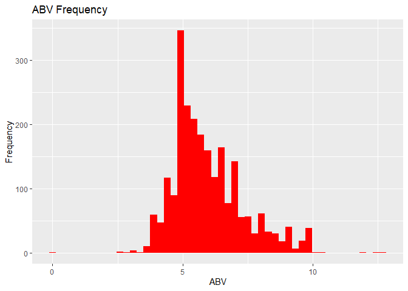<!-- -->

```r
ggplot(data = df, mapping = aes(x = ABV * 100)) + 
  geom_histogram(fill = "red", bins = 76) + labs(x = "ABV", y = "Frequency", title = "ABV Frequency")
```

```
## Warning: Removed 62 rows containing non-finite values (stat_bin).
```

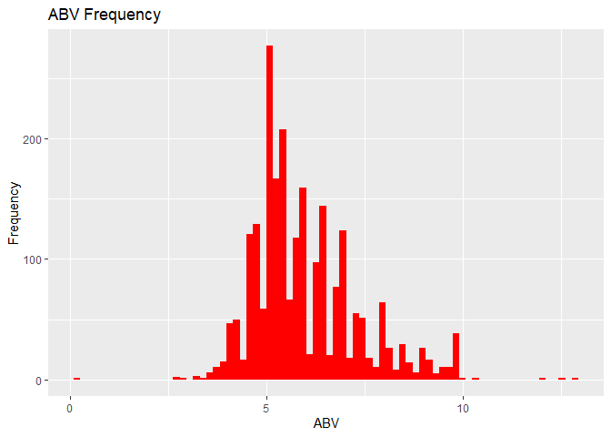<!-- -->

```r
ggplot(data = df, mapping = aes(x = ABV * 100)) + 
  geom_boxplot(fill = "red", width=.1) + labs(x = "ABV", title = "ABV Distribution") + theme(axis.text.y=element_text(colour="white"))
```

```
## Warning: Removed 62 rows containing non-finite values (stat_boxplot).
```

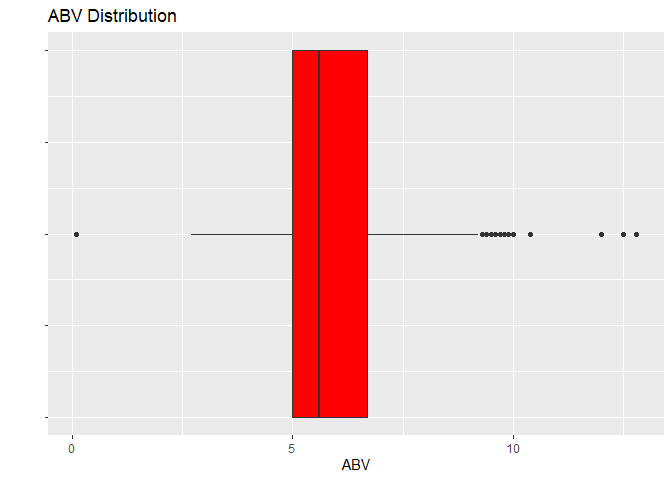<!-- -->


ABV is right skewed and several outliers appear for high ABVs. There also appears to be an outlier that has approximately 0 ABV (ABV of 0.001 for a low alcohol beer called Scotty K NA).  

# Is there an apparent relationship between the bitterness of the beer and its alcoholic content? Draw a scatter plot.  Make your best judgment of a relationship and EXPLAIN your answer.

```r
cor(df$ABV, df$IBU, use = "complete.obs") 
```

```
## [1] 0.6706215
```

```r
ggplot(data = df, mapping = aes(x = IBU, y = ABV * 100)) + 
  geom_point(color = "red") + labs(x = "ABV", y = "IBU", title = "ABV vs IBU")
```

```
## Warning: Removed 1005 rows containing missing values (geom_point).
```

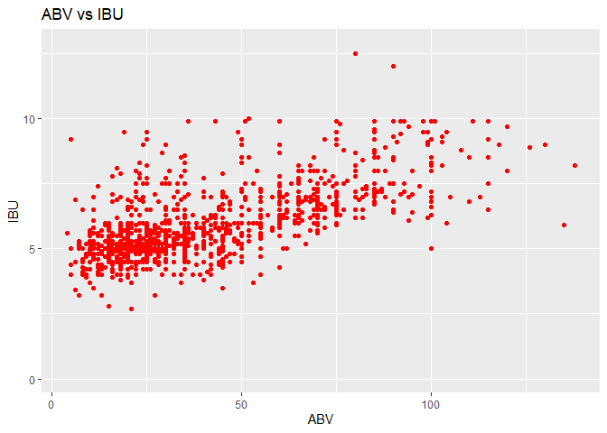<!-- -->


There appears to be a positive relationship between ABV and IBU, with a linear correlation value of 0.67. 0 represents no relationship whatsoever and 1 represents a perfect association. This suggests a moderate relationship.


# Budweiser would also like to investigate the difference with respect to IBU and ABV between IPAs (India Pale Ales) and other types of Ale (any beer with “Ale” in its name other than IPA).  You decide to use KNN classification to investigate this relationship.  Provide statistical evidence one way or the other. You can of course assume your audience is comfortable with percentages … KNN is very easy to understand conceptually.

First, we need to see how IPAs and Ales are classified in the Style column.

```r
sort(df$Style) %>% unique()
```

```
##   [1] ""                                   
##   [2] "Abbey Single Ale"                   
##   [3] "Altbier"                            
##   [4] "American Adjunct Lager"             
##   [5] "American Amber / Red Ale"           
##   [6] "American Amber / Red Lager"         
##   [7] "American Barleywine"                
##   [8] "American Black Ale"                 
##   [9] "American Blonde Ale"                
##  [10] "American Brown Ale"                 
##  [11] "American Dark Wheat Ale"            
##  [12] "American Double / Imperial IPA"     
##  [13] "American Double / Imperial Pilsner" 
##  [14] "American Double / Imperial Stout"   
##  [15] "American India Pale Lager"          
##  [16] "American IPA"                       
##  [17] "American Malt Liquor"               
##  [18] "American Pale Ale (APA)"            
##  [19] "American Pale Lager"                
##  [20] "American Pale Wheat Ale"            
##  [21] "American Pilsner"                   
##  [22] "American Porter"                    
##  [23] "American Stout"                     
##  [24] "American Strong Ale"                
##  [25] "American White IPA"                 
##  [26] "American Wild Ale"                  
##  [27] "Baltic Porter"                      
##  [28] "Belgian Dark Ale"                   
##  [29] "Belgian IPA"                        
##  [30] "Belgian Pale Ale"                   
##  [31] "Belgian Strong Dark Ale"            
##  [32] "Belgian Strong Pale Ale"            
##  [33] "Berliner Weissbier"                 
##  [34] "Bière de Garde"                    
##  [35] "Bock"                               
##  [36] "Braggot"                            
##  [37] "California Common / Steam Beer"     
##  [38] "Chile Beer"                         
##  [39] "Cider"                              
##  [40] "Cream Ale"                          
##  [41] "Czech Pilsener"                     
##  [42] "Doppelbock"                         
##  [43] "Dortmunder / Export Lager"          
##  [44] "Dubbel"                             
##  [45] "Dunkelweizen"                       
##  [46] "English Barleywine"                 
##  [47] "English Bitter"                     
##  [48] "English Brown Ale"                  
##  [49] "English Dark Mild Ale"              
##  [50] "English India Pale Ale (IPA)"       
##  [51] "English Pale Ale"                   
##  [52] "English Pale Mild Ale"              
##  [53] "English Stout"                      
##  [54] "English Strong Ale"                 
##  [55] "Euro Dark Lager"                    
##  [56] "Euro Pale Lager"                    
##  [57] "Extra Special / Strong Bitter (ESB)"
##  [58] "Flanders Oud Bruin"                 
##  [59] "Flanders Red Ale"                   
##  [60] "Foreign / Export Stout"             
##  [61] "Fruit / Vegetable Beer"             
##  [62] "German Pilsener"                    
##  [63] "Gose"                               
##  [64] "Grisette"                           
##  [65] "Hefeweizen"                         
##  [66] "Herbed / Spiced Beer"               
##  [67] "Irish Dry Stout"                    
##  [68] "Irish Red Ale"                      
##  [69] "Kölsch"                            
##  [70] "Keller Bier / Zwickel Bier"         
##  [71] "Kristalweizen"                      
##  [72] "Light Lager"                        
##  [73] "Low Alcohol Beer"                   
##  [74] "Märzen / Oktoberfest"              
##  [75] "Maibock / Helles Bock"              
##  [76] "Mead"                               
##  [77] "Milk / Sweet Stout"                 
##  [78] "Munich Dunkel Lager"                
##  [79] "Munich Helles Lager"                
##  [80] "Oatmeal Stout"                      
##  [81] "Old Ale"                            
##  [82] "Other"                              
##  [83] "Pumpkin Ale"                        
##  [84] "Quadrupel (Quad)"                   
##  [85] "Radler"                             
##  [86] "Rauchbier"                          
##  [87] "Roggenbier"                         
##  [88] "Russian Imperial Stout"             
##  [89] "Rye Beer"                           
##  [90] "Saison / Farmhouse Ale"             
##  [91] "Schwarzbier"                        
##  [92] "Scotch Ale / Wee Heavy"             
##  [93] "Scottish Ale"                       
##  [94] "Shandy"                             
##  [95] "Smoked Beer"                        
##  [96] "Tripel"                             
##  [97] "Vienna Lager"                       
##  [98] "Wheat Ale"                          
##  [99] "Winter Warmer"                      
## [100] "Witbier"
```
It appears all IPAs will contain "IPA" in their name, and all Ales will contain "Ales" in their name. We will create a column that classifies as IPA, Ale, or neither. We will select IPAs then Ales, rather than the reverse, so Ales don't also detect "India Pale Ales"

```r
df <- df %>% mutate(IPA_Or_Ale = ifelse(grepl("IPA", df$Style, fixed = TRUE), "IPA", ifelse(grepl("Ale", df$Style, fixed = TRUE), "Ale", NA)))
```


Now, we can start thinking about features to includes. We will create a column for the length of each beer name (excluding words that are IPA or Ale).

```r
df <- df %>% mutate(Beer_Name_Modified = Beer_Name) 
stopwords = c("IPA", "I.P.A.", "India","Pale","Ale","Ales")
for(i in 1:nrow(df)){
  x <- unlist(strsplit(df$Beer_Name_Modified[i], " "))
  x <- x[!x %in% stopwords]
  df$Beer_Name_Modified[i] <- paste(x, collapse = " ") 
}

df <- df %>% mutate(Beer_Name_Len = nchar(df$Beer_Name_Modified))
```

We will assess the possible features.

```r
df %>% group_by(IPA_Or_Ale) %>% summarise(Len_Med=median(Beer_Name_Len), Len_Mean=mean(Beer_Name_Len), Len_Std=sd(Beer_Name_Len))
```

```
## `summarise()` ungrouping output (override with `.groups` argument)
```

```
## # A tibble: 3 x 4
##   IPA_Or_Ale Len_Med Len_Mean Len_Std
##   <chr>        <dbl>    <dbl>   <dbl>
## 1 Ale             14     14.8    6.59
## 2 IPA             12     12.7    6.09
## 3 <NA>            16     17.0    7.23
```

```r
df %>% group_by(IPA_Or_Ale) %>% summarise(Ounce_Med=median(Ounces, na.rm = TRUE), Ounce_Std=sd(Ounces, na.rm = TRUE), Ounce_Max=max(Ounces, na.rm = TRUE))
```

```
## `summarise()` ungrouping output (override with `.groups` argument)
```

```
## # A tibble: 3 x 4
##   IPA_Or_Ale Ounce_Med Ounce_Std Ounce_Max
##   <chr>          <dbl>     <dbl>     <dbl>
## 1 Ale               12      2.25        32
## 2 IPA               12      2.56        32
## 3 <NA>              12      2.31        32
```

```r
df %>% group_by(IPA_Or_Ale) %>% summarise(ABV_Med=median(ABV * 100, na.rm = TRUE), ABV_Mean=mean(ABV * 100, na.rm = TRUE), ABV_Std=sd(ABV * 100, na.rm = TRUE))
```

```
## `summarise()` ungrouping output (override with `.groups` argument)
```

```
## # A tibble: 3 x 4
##   IPA_Or_Ale ABV_Med ABV_Mean ABV_Std
##   <chr>        <dbl>    <dbl>   <dbl>
## 1 Ale            5.5     5.68    1.12
## 2 IPA            6.8     6.88    1.24
## 3 <NA>           5.3     5.71    1.40
```

```r
df %>% group_by(IPA_Or_Ale) %>% summarise(IBU_Med=median(IBU, na.rm = TRUE), IBU_Mean=mean(IBU, na.rm = TRUE), IBU_Std=sd(IBU, na.rm = TRUE))
```

```
## `summarise()` ungrouping output (override with `.groups` argument)
```

```
## # A tibble: 3 x 4
##   IPA_Or_Ale IBU_Med IBU_Mean IBU_Std
##   <chr>        <dbl>    <dbl>   <dbl>
## 1 Ale             30     34.3    18.0
## 2 IPA             70     71.9    19.5
## 3 <NA>            24     27.9    17.6
```
There does not appear to be a considerable difference between IPAs and Ales regarding their name length or ounces. This suggests that they may not be important features. ABV and IBU, however, show significant differences of mean/median with respect to their standard deviations. Therefore, they will be used as features.

Now, we will check for a difference in source states of Ales vs. IPAs. If there is a difference, we can find the state's longitude and latitude for the KNN.

```r
df %>% filter(IPA_Or_Ale == "IPA") %>% group_by(State) %>% summarise(IPA_count = n(), IPA_percent_representation = n() / nrow(.) * 100 ) %>% arrange(desc(IPA_percent_representation))
```

```
## `summarise()` ungrouping output (override with `.groups` argument)
```

```
## # A tibble: 49 x 3
##    State IPA_count IPA_percent_representation
##    <chr>     <int>                      <dbl>
##  1 " CA"        58                      10.2 
##  2 " CO"        57                       9.98
##  3 " IN"        34                       5.95
##  4 " OR"        31                       5.43
##  5 " MI"        30                       5.25
##  6 " IL"        25                       4.38
##  7 " MA"        24                       4.20
##  8 " PA"        23                       4.03
##  9 " TX"        23                       4.03
## 10 " WA"        22                       3.85
## # ... with 39 more rows
```

```r
df %>% filter(IPA_Or_Ale == "Ale") %>% group_by(State) %>% summarise(Ale_count = n(), Ale_percent_representation = n() / nrow(.) * 100 ) %>% arrange(desc(Ale_percent_representation))
```

```
## `summarise()` ungrouping output (override with `.groups` argument)
```

```
## # A tibble: 51 x 3
##    State Ale_count Ale_percent_representation
##    <chr>     <int>                      <dbl>
##  1 " CO"       121                      12.6 
##  2 " CA"        66                       6.85
##  3 " MI"        64                       6.65
##  4 " IN"        54                       5.61
##  5 " TX"        54                       5.61
##  6 " OR"        53                       5.50
##  7 " IL"        43                       4.47
##  8 " PA"        33                       3.43
##  9 " NY"        28                       2.91
## 10 " WI"        27                       2.80
## # ... with 41 more rows
```
There appears to be minimal variation between source states of Ales vs. IPAs. The top 20 states tend to vary by about 1% for the amount of beers that the state sources.

We will use ABV and IBU as our only features. Below you can view how IPAs and Ales tend to cluster.

```r
ggplot(data = df, mapping = aes(x = IBU, y = ABV * 100, color = IPA_Or_Ale)) + 
  geom_point() + labs(x = "ABV", y = "IBU", title = "ABV vs IBU")
```

```
## Warning: Removed 1005 rows containing missing values (geom_point).
```

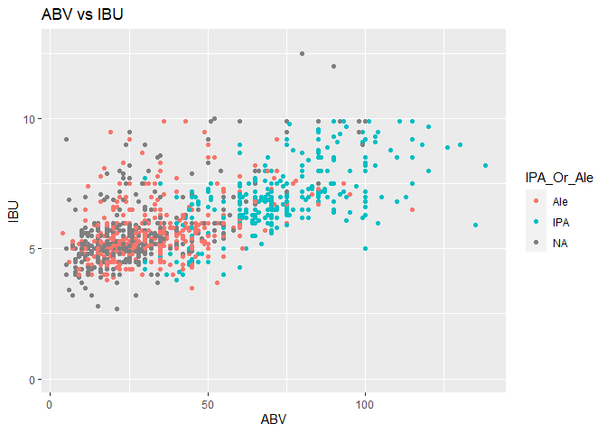<!-- -->


Next, we filter out rows that aren't ABV or IBU.

```r
df_clean <- df %>% filter(!is.na(ABV) & !is.na(IBU) & !is.na(IPA_Or_Ale))

df_clean %>% group_by(IPA_Or_Ale) %>% summarise(count = n())
```

```
## `summarise()` ungrouping output (override with `.groups` argument)
```

```
## # A tibble: 2 x 2
##   IPA_Or_Ale count
##   <chr>      <int>
## 1 Ale          552
## 2 IPA          392
```
We also find fairly equal sample sizes, which is necessary to perform an accurate KNN.

Now, we will standardize our features so they have equal impact, and separate our data into train and test sets.

```r
df_clean$ABV_std <- scale(df_clean$ABV)
df_clean$IBU_std <- scale(df_clean$IBU)

set.seed(123)
trainIndices = sample(1:dim(df_clean)[1],round(.7 * dim(df_clean)[1]))
train = df_clean[trainIndices,]
test = df_clean[-trainIndices,]
```

We will perform a cross validation with k = 1-100 with a plot of k (x-axis) versus accuracy.  We will use this plot to tune the hyperparameter k. 

```r
accs = data.frame(accuracy = numeric(60), k = numeric(60))

for(i in 1:60)
{
  set.seed(123)
  classifications = knn(train[,c("ABV_std","IBU_std")],test[,c("ABV_std","IBU_std")],train$IPA_Or_Ale,prob = TRUE, k = i)
  CM = confusionMatrix(table(classifications,test$IPA_Or_Ale))
  accs$accuracy[i] = CM$overall[1]
  accs$k[i] = i
}

plot(accs$k,accs$accuracy, type = "l", xlab = "k")
```

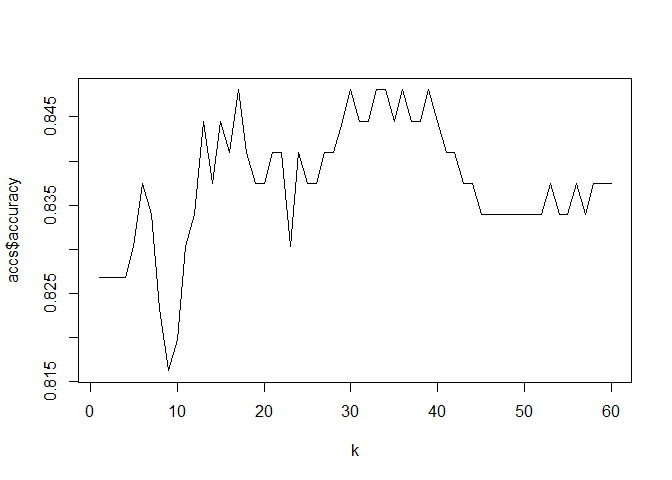<!-- -->


Based off this particular split of train and test data, the best k is about 33.

Now we will check for the exact accuracy, along with sensitivity and specificity. Additionally, we will predict using Naive Bayes.

```r
set.seed(123)
classifications = knn(train[,c("ABV_std","IBU_std")],test[,c("ABV_std","IBU_std")],train$IPA_Or_Ale,prob = TRUE, k =33)
confusionMatrix(table(classifications,test$IPA_Or_Ale))
```

```
## Confusion Matrix and Statistics
## 
##                
## classifications Ale IPA
##             Ale 126  21
##             IPA  22 114
##                                           
##                Accuracy : 0.8481          
##                  95% CI : (0.8008, 0.8878)
##     No Information Rate : 0.523           
##     P-Value [Acc > NIR] : <2e-16          
##                                           
##                   Kappa : 0.6956          
##                                           
##  Mcnemar's Test P-Value : 1               
##                                           
##             Sensitivity : 0.8514          
##             Specificity : 0.8444          
##          Pos Pred Value : 0.8571          
##          Neg Pred Value : 0.8382          
##              Prevalence : 0.5230          
##          Detection Rate : 0.4452          
##    Detection Prevalence : 0.5194          
##       Balanced Accuracy : 0.8479          
##                                           
##        'Positive' Class : Ale             
## 
```

```r
train$IPA_Or_Ale <- as.factor(train$IPA_Or_Ale)
model = naiveBayes(train[,c("ABV","IBU")],train$IPA_Or_Ale)
confusionMatrix(table(predict(model,test[,c("ABV","IBU")]),test$IPA_Or_Ale))
```

```
## Confusion Matrix and Statistics
## 
##      
##       Ale IPA
##   Ale 126  26
##   IPA  22 109
##                                           
##                Accuracy : 0.8304          
##                  95% CI : (0.7815, 0.8722)
##     No Information Rate : 0.523           
##     P-Value [Acc > NIR] : <2e-16          
##                                           
##                   Kappa : 0.6596          
##                                           
##  Mcnemar's Test P-Value : 0.665           
##                                           
##             Sensitivity : 0.8514          
##             Specificity : 0.8074          
##          Pos Pred Value : 0.8289          
##          Neg Pred Value : 0.8321          
##              Prevalence : 0.5230          
##          Detection Rate : 0.4452          
##    Detection Prevalence : 0.5371          
##       Balanced Accuracy : 0.8294          
##                                           
##        'Positive' Class : Ale             
## 
```
KNN accurately predicted 84.8% of the time, which slightly outperformed Naive Bayes at 83%.

Below is a loop to repeat the previous KNN for 100 different random seeds. We will find the average accuracy to get a more stable statistic to evaluate the model.

```r
splitPerc <- .7
iterations = 100
numks = 100

masterAcc = matrix(nrow = iterations, ncol = numks)
  
for(j in 1:iterations)
{
accs = data.frame(accuracy = numeric(100), k = numeric(100))
trainIndices = sample(1:dim(df_clean)[1],round(splitPerc * dim(df_clean)[1]))
train = df_clean[trainIndices,]
test = df_clean[-trainIndices,]
for(i in 1:numks)
{
  classifications = knn(train[,c("ABV_std","IBU_std")],test[,c("ABV_std","IBU_std")],train$IPA_Or_Ale,prob = TRUE, k =i)
  CM = confusionMatrix(table(classifications,test$IPA_Or_Ale))
  masterAcc[j,i] = CM$overall[1]
}

}

MeanAcc = colMeans(masterAcc)

mean(MeanAcc)
```

```
## [1] 0.855377
```

```r
plot(seq(1,numks,1),MeanAcc, type = "l")
```

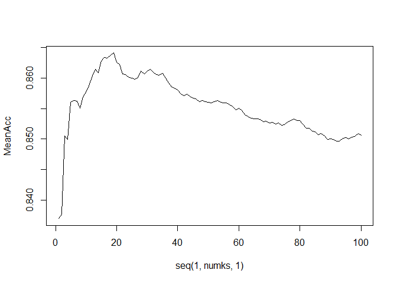<!-- -->
This is the mean accuracy for 100 iterations of KNN.

Below is the same random seeding process but for Naive Bayes.

```r
iterations = 100

masterAcc = matrix(nrow = iterations, ncol = 3)

for(j in 1:iterations)
{
  trainIndices = sample(1:dim(df_clean)[1],round(splitPerc * dim(df_clean)[1]))
  train = df_clean[trainIndices,]
  test = df_clean[-trainIndices,]
  train$IPA_Or_Ale <- as.factor(train$IPA_Or_Ale)
  
  model = naiveBayes(train[,c("ABV","IBU")],train$IPA_Or_Ale)
confusionMatrix(table(predict(model,test[,c("ABV","IBU")]),test$IPA_Or_Ale))
  row = c(CM$overall[1],CM$byClass[1],CM$byClass[2])
  # CM$overall[1] returns the accuracy
  # CM$byClass[1] returns the sensitivity
  # CM$byClass[2] returns the specificity
  masterAcc[j,1:3] = row

}

MeanAcc = colMeans(masterAcc)
MeanAcc
```

```
## [1] 0.8374558 0.8475610 0.8235294
```
This returns the accuracy, sensitivity, and specificity, respectively.

Based off our averages, KNN accurately predicted about 86.5% of the time, which slightly outperformed Naive Bayes again, at 85.9%.

# Find one other useful inference from the data that you feel Budweiser may be able to find value in.  You must convince them why it is important and back up your conviction with appropriate statistical evidence. 


First, we will explore ounces with other variables.
We will do a quick check for Ounces anomalies. Are there any popular styles that are primarily in uncommon ounces?

```r
df %>% group_by(Style, Ounces) %>% summarise(count = n())
```

```
## `summarise()` regrouping output by 'Style' (override with `.groups` argument)
```

```
## # A tibble: 210 x 3
## # Groups:   Style [100]
##    Style                      Ounces count
##    <chr>                       <dbl> <int>
##  1 ""                             12     3
##  2 ""                             16     1
##  3 ""                             32     1
##  4 "Abbey Single Ale"             12     2
##  5 "Altbier"                      12     8
##  6 "Altbier"                      16     5
##  7 "American Adjunct Lager"       12    14
##  8 "American Adjunct Lager"       16     3
##  9 "American Adjunct Lager"       24     1
## 10 "American Amber / Red Ale"     12    90
## # ... with 200 more rows
```

```r
df %>% group_by(Style, Ounces) %>% summarise(count = n()) %>% arrange(desc(Ounces))
```

```
## `summarise()` regrouping output by 'Style' (override with `.groups` argument)
```

```
## # A tibble: 210 x 3
## # Groups:   Style [100]
##    Style                            Ounces count
##    <chr>                             <dbl> <int>
##  1 ""                                   32     1
##  2 "American Double / Imperial IPA"     32     1
##  3 "American IPA"                       32     1
##  4 "American Pale Ale (APA)"            32     1
##  5 "Belgian Pale Ale"                   32     1
##  6 "American Adjunct Lager"             24     1
##  7 "American Amber / Red Lager"         24     1
##  8 "American Blonde Ale"                24     1
##  9 "American Double / Imperial IPA"     24     1
## 10 "American IPA"                       24     5
## # ... with 200 more rows
```
There are not any popular beer styles that are more likely to appear in uncommon sizes compared to the standard 12 or 16 oz.

We will check for ounces vs IBU and ABV.

```r
ggplot(data = df, mapping = aes(x = ABV * 100, y = Ounces)) + 
  geom_point(color = "red") + labs(x = "ABV", y = "Ounces", title = "ABV vs Ounces")
```

```
## Warning: Removed 62 rows containing missing values (geom_point).
```

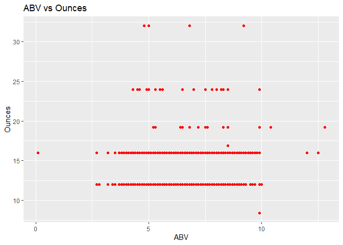<!-- -->

```r
ggplot(data = df, mapping = aes(x = IBU, y = Ounces)) + 
  geom_point(color = "red") + labs(x = "IBU", y = "Ounces", title = "IBU vs Ounces")
```

```
## Warning: Removed 1005 rows containing missing values (geom_point).
```

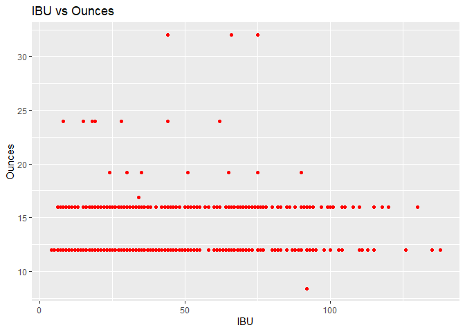<!-- -->


Visually, it appears that large beers are not very bitter.


```r
cor(df$IBU, df$Ounces, use = "complete.obs") 
```

```
## [1] 0.05469083
```

```r
fit = lm(IBU~Ounces, data = df)
summary(fit)
```

```
## 
## Call:
## lm(formula = IBU ~ Ounces, data = df)
## 
## Residuals:
##     Min      1Q  Median      3Q     Max 
## -41.323 -21.763  -6.763  20.237  96.237 
## 
## Coefficients:
##             Estimate Std. Error t value Pr(>|t|)    
## (Intercept)  34.2036     4.2051   8.134 9.06e-16 ***
## Ounces        0.6300     0.3071   2.052   0.0404 *  
## ---
## Signif. codes:  0 '***' 0.001 '**' 0.01 '*' 0.05 '.' 0.1 ' ' 1
## 
## Residual standard error: 25.92 on 1403 degrees of freedom
##   (1005 observations deleted due to missingness)
## Multiple R-squared:  0.002991,	Adjusted R-squared:  0.00228 
## F-statistic: 4.209 on 1 and 1403 DF,  p-value: 0.04039
```
We found the correlation between IBU and Ounces to barely meet statistical significance. However,it is not practically significant.

Next, check for beer name length vs. ounces

```r
df <- df %>% mutate(Beer_Name_Len_nomod = nchar(df$Beer_Name))

ggplot(data = df, mapping = aes(x = Beer_Name_Len_nomod, y = Ounces)) + 
  geom_point(color = "red") + labs(x = "Beer_Name_Len_nomod", y = "Ounces", title = "Beer Name Length vs Ounces")
```

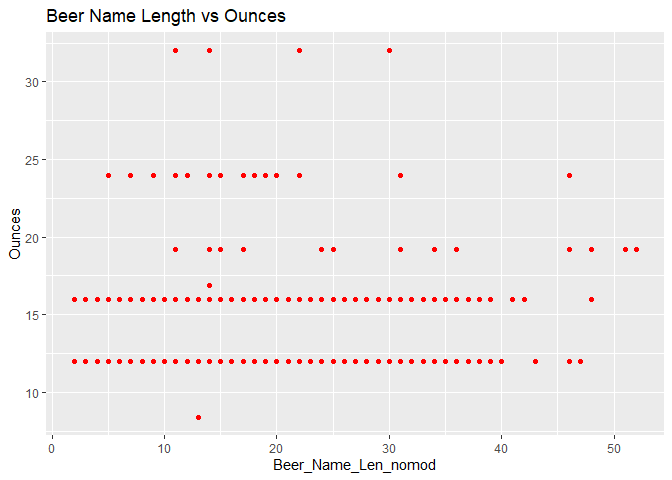<!-- -->


There are no apparent trends here.

We will now explore Fruit / Vegetable beers, and then Ciders

```r
# Don't filter for Ciders, because Ciders don't have IBUs associated
df_clean <- df %>% filter(df$Style == "Fruit / Vegetable Beer")

ggplot(data = df_clean, mapping = aes(x = IBU, y = ABV * 100)) + 
  geom_point(color = "red") + labs(x = "ABV", y = "IBU", title = "Fruit Beers: ABV vs IBU")
```

```
## Warning: Removed 19 rows containing missing values (geom_point).
```

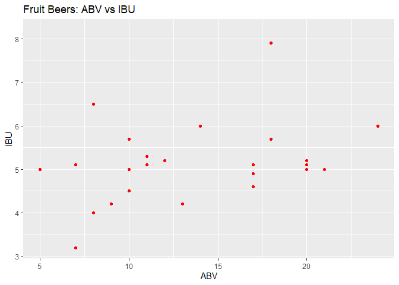<!-- -->

```r
ggplot(data = df_clean, mapping = aes(x = IBU)) + 
  geom_histogram(fill = "red", bins = 10) + labs(x = "IBU", y = "Frequency", title = "IBU Frequency of Fruit Beers")
```

```
## Warning: Removed 19 rows containing non-finite values (stat_bin).
```

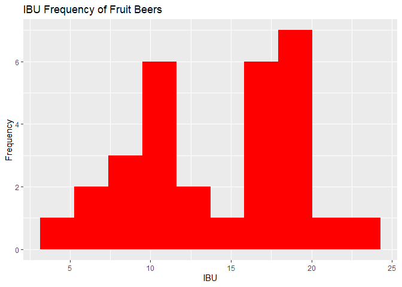<!-- -->

```r
# Add ciders to the list
df_clean <- df %>% filter(df$Style == "Fruit / Vegetable Beer" | df$Style == "Cider")

ggplot(data = df_clean, mapping = aes(x = ABV * 100)) + 
  geom_histogram(fill = "red", bins = 15) + labs(x = "ABV", y = "Frequency", title = "ABV Frequency of Fruits/Ciders")
```

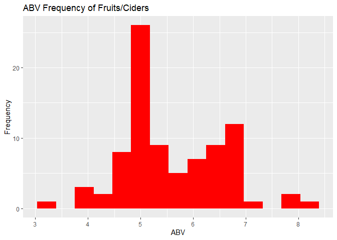<!-- -->


Fruit beers have no visual correlation between IBU and ABV. The IBUs have a bimodal distribution, which could be due to its small sample size. Fruits and Ciders also appear to have a bimodal distribution. This makes sense because ABV is correlated to IBU.

We will first revisit the top beers by state, followed by the top Fruit Beers by state and then by city.

```r
df %>% group_by(State) %>% summarise(count = n(),all_states_percent_rep = n() / nrow(.) * 100) %>% arrange(desc(count))
```

```
## `summarise()` ungrouping output (override with `.groups` argument)
```

```
## # A tibble: 51 x 3
##    State count all_states_percent_rep
##    <chr> <int>                  <dbl>
##  1 " CO"   265                  11.0 
##  2 " CA"   183                   7.59
##  3 " MI"   162                   6.72
##  4 " IN"   139                   5.77
##  5 " TX"   130                   5.39
##  6 " OR"   125                   5.19
##  7 " PA"   100                   4.15
##  8 " IL"    91                   3.78
##  9 " WI"    87                   3.61
## 10 " MA"    82                   3.40
## # ... with 41 more rows
```

```r
df_clean %>% group_by(State) %>% summarise(count = n(),fruit_state_percent_rep = n() / nrow(.) * 100) %>% arrange(desc(count))
```

```
## `summarise()` ungrouping output (override with `.groups` argument)
```

```
## # A tibble: 24 x 3
##    State count fruit_state_percent_rep
##    <chr> <int>                   <dbl>
##  1 " MI"    17                   19.8 
##  2 " OR"     9                   10.5 
##  3 " CA"     5                    5.81
##  4 " IN"     5                    5.81
##  5 " MA"     5                    5.81
##  6 " OH"     5                    5.81
##  7 " PA"     5                    5.81
##  8 " WA"     5                    5.81
##  9 " VT"     4                    4.65
## 10 " AZ"     3                    3.49
## # ... with 14 more rows
```

```r
df_clean %>% group_by(City) %>% summarise(count = n(),fruit_city_percent_rep = n() / nrow(.) * 100) %>% arrange(desc(count))
```

```
## `summarise()` ungrouping output (override with `.groups` argument)
```

```
## # A tibble: 55 x 3
##    City            count fruit_city_percent_rep
##    <chr>           <int>                  <dbl>
##  1 Seattle             5                   5.81
##  2 Spring Lake         5                   5.81
##  3 Cincinnati          4                   4.65
##  4 Corvallis           4                   4.65
##  5 Portland            4                   4.65
##  6 San Francisco       4                   4.65
##  7 Aurora              3                   3.49
##  8 Somerset Center     3                   3.49
##  9 St. John's          3                   3.49
## 10 Biglerville         2                   2.33
## # ... with 45 more rows
```
Michigan sources the third highest amount of beers in the country with 6.7%. If you look at only Ciders and Fruit/Vegetable Beers, they increase to first with 19.8%. Does this indicate cheaper source materials or higher demand in this area?

Do we see any similarities with pumpkin ales?

```r
df %>% group_by(State) %>% summarise(count = n(),all_states_percent_rep = n() / nrow(.) * 100) %>% arrange(desc(count))
```

```
## `summarise()` ungrouping output (override with `.groups` argument)
```

```
## # A tibble: 51 x 3
##    State count all_states_percent_rep
##    <chr> <int>                  <dbl>
##  1 " CO"   265                  11.0 
##  2 " CA"   183                   7.59
##  3 " MI"   162                   6.72
##  4 " IN"   139                   5.77
##  5 " TX"   130                   5.39
##  6 " OR"   125                   5.19
##  7 " PA"   100                   4.15
##  8 " IL"    91                   3.78
##  9 " WI"    87                   3.61
## 10 " MA"    82                   3.40
## # ... with 41 more rows
```

```r
df %>% filter(df$Style == "Pumpkin Ale") %>% group_by(State) %>% summarise(count = n(),pumpkin_state_percent_rep = n() / nrow(.) * 100) %>% arrange(desc(count))
```

```
## `summarise()` ungrouping output (override with `.groups` argument)
```

```
## # A tibble: 14 x 3
##    State count pumpkin_state_percent_rep
##    <chr> <int>                     <dbl>
##  1 " CO"     4                     17.4 
##  2 " MA"     4                     17.4 
##  3 " PA"     3                     13.0 
##  4 " IL"     2                      8.70
##  5 " CA"     1                      4.35
##  6 " KY"     1                      4.35
##  7 " ME"     1                      4.35
##  8 " MI"     1                      4.35
##  9 " MN"     1                      4.35
## 10 " MO"     1                      4.35
## 11 " NC"     1                      4.35
## 12 " NE"     1                      4.35
## 13 " NY"     1                      4.35
## 14 " UT"     1                      4.35
```
Massachusetts had the largest jump with a 14% increase of pumpkin ales sourced compared to their total beers sourced .


# Additional Brewery Tour Proposal
We are going to investigate the Budweiser breweries that are offering public tours and do a comparison with the main competitors (note that most of the tours are currently on hold because of Coronavirus)

```r
# Getting the addresses of the breweries that can be toured for Budweiser and their main competitors
# The main competitors were selected from the "Top 50 Overall Brewing Companies" at https://www.brewersassociation.org/press-releases/brewers-association-announces-top-50-brewing-companies-by-sales-volume-of-2019/
# The address format can be checked on this web site to make sure it will work correctly: https://geocoding.geo.census.gov/geocoder/locations/onelineaddress?form

# First for Budweiser, then for the main competitors, we will get the coordinates of each brewery offering tours so that we can plot it on the map
# The data frame "all_breweries_coordinates" will have 4 columns:
# - singlelineaddress: address in the brewery in 1 line (with street, city, state and optionally zip code)
# - lat: the latitude for the coordinate
# - long: the longitude for the coordinate
# - Company: the company that owns the brewery

# Addresses of Budweiser breweries offering tours taken from https://www.budweisertours.com/
budweiser_breweries_addresses <- tibble(singlelineaddress = c('2523 Frontage Rd, Fort Collins, CO', 
                    '221 Daniel Webster Hwy, Merrimack, NH',
                    '1200 Lynch St, St. Louis, MO'))
all_breweries_coordinates <- data.frame(budweiser_breweries_addresses %>% geocode(address = singlelineaddress, method = 'census', verbose = TRUE), Company = "Budweiser")
```

```
## Number of Unique Addresses: 3
```

```
## Passing 3 addresses to the census batch geocoder
```

```
## Querying API URL: https://geocoding.geo.census.gov/geocoder/locations/addressbatch
```

```
## Passing the following parameters to the API:
```

```
## format : "json"
```

```
## benchmark : "Public_AR_Current"
```

```
## vintage : "Current_Current"
```

```
## 
```

```
## Query completed in: 1.2 seconds
```

```r
# Addresses of Coors breweries offering tours taken from https://www.coorsbrewerytour.com/
coors_breweries_addresses <- tibble(singlelineaddress = c('311 10th St, Golden, CO'))
all_breweries_coordinates <- rbind(all_breweries_coordinates, data.frame(coors_breweries_addresses %>% geocode(address = singlelineaddress, method = 'census', verbose = TRUE), Company = "Coors"))
```

```
## Number of Unique Addresses: 1
```

```
## Querying API URL: https://geocoding.geo.census.gov/geocoder/locations/onelineaddress
```

```
## Passing the following parameters to the API:
```

```
## address : "311 10th St, Golden, CO"
```

```
## format : "json"
```

```
## benchmark : "Public_AR_Current"
```

```
## vintage : "Current_Current"
```

```
## 
```

```
## Query completed in: 1.2 seconds
```

```
## 
```

```r
# Addresses of Samuel Adams breweries offering tours taken from https://www.samueladams.com/brewerytours
sam_adams_breweries_addresses <- tibble(singlelineaddress = c('30 Germania St, Boston, MA 02130'))
all_breweries_coordinates <- rbind(all_breweries_coordinates, data.frame(sam_adams_breweries_addresses %>% geocode(address = singlelineaddress, method = 'census', verbose = TRUE), Company = "Samuel Adams"))
```

```
## Number of Unique Addresses: 1
```

```
## Querying API URL: https://geocoding.geo.census.gov/geocoder/locations/onelineaddress
```

```
## Passing the following parameters to the API:
```

```
## address : "30 Germania St, Boston, MA 02130"
```

```
## format : "json"
```

```
## benchmark : "Public_AR_Current"
```

```
## vintage : "Current_Current"
```

```
## 
```

```
## Query completed in: 0.3 seconds
```

```
## 
```

```r
# Addresses of Pabst breweries offering tours taken from https://pabst.com/
pabst_breweries_addresses <- tibble(singlelineaddress = c('1037 W Juneau Ave, Milwaukee, WI 53233'))
all_breweries_coordinates <- rbind(all_breweries_coordinates, data.frame(pabst_breweries_addresses %>% geocode(address = singlelineaddress, method = 'census', verbose = TRUE), Company = "Pabst"))
```

```
## Number of Unique Addresses: 1
```

```
## Querying API URL: https://geocoding.geo.census.gov/geocoder/locations/onelineaddress
```

```
## Passing the following parameters to the API:
```

```
## address : "1037 W Juneau Ave, Milwaukee, WI 53233"
```

```
## format : "json"
```

```
## benchmark : "Public_AR_Current"
```

```
## vintage : "Current_Current"
```

```
## 
```

```
## Query completed in: 4.8 seconds
```

```
## 
```

```r
# Addresses of Guinness (part of Diageo) breweries offering tours taken from https://www.guinnessbrewerybaltimore.com/tours-and-experiences
guinness_breweries_addresses <- tibble(singlelineaddress = c('5001 Washington Blvd, Halethorpe, MD 21227'))
all_breweries_coordinates <- rbind(all_breweries_coordinates, data.frame(guinness_breweries_addresses %>% geocode(address = singlelineaddress, method = 'census', verbose = TRUE), Company = "Guinness"))
```

```
## Number of Unique Addresses: 1
```

```
## Querying API URL: https://geocoding.geo.census.gov/geocoder/locations/onelineaddress
```

```
## Passing the following parameters to the API:
```

```
## address : "5001 Washington Blvd, Halethorpe, MD 21227"
```

```
## format : "json"
```

```
## benchmark : "Public_AR_Current"
```

```
## vintage : "Current_Current"
```

```
## 
```

```
## Query completed in: 10.4 seconds
```

```
## 
```

```r
# Addresses of Yuengling breweries offering tours taken from https://www.yuengling.com/visit-us/ (Tampa location will open in 2022)
yuengling_breweries_addresses <- tibble(singlelineaddress = c('420 Mahantongo Street, Pottsville, PA 17901',
                                                             '11111 N 30th St, Tampa, FL 33612'))
all_breweries_coordinates <- rbind(all_breweries_coordinates, data.frame(yuengling_breweries_addresses %>% geocode(address = singlelineaddress, method = 'census', verbose = TRUE), Company = "Yuengling"))
```

```
## Number of Unique Addresses: 2
```

```
## Passing 2 addresses to the census batch geocoder
```

```
## Querying API URL: https://geocoding.geo.census.gov/geocoder/locations/addressbatch
```

```
## Passing the following parameters to the API:
```

```
## format : "json"
```

```
## benchmark : "Public_AR_Current"
```

```
## vintage : "Current_Current"
```

```
## 
```

```
## Query completed in: 1.7 seconds
```

```r
# Addresses of Sierra Nevada breweries offering tours taken from https://sierranevada.com/visit/
sierra_nevada_breweries_addresses <- tibble(singlelineaddress = c('100 Sierra Nevada Way Mills River,NC',
                                                             '1075 East 20th Street, Chico, CA'))
all_breweries_coordinates <- rbind(all_breweries_coordinates, data.frame(sierra_nevada_breweries_addresses %>% geocode(address = singlelineaddress, method = 'census', verbose = TRUE), Company = "Sierra Nevada"))
```

```
## Number of Unique Addresses: 2
```

```
## Passing 2 addresses to the census batch geocoder
```

```
## Querying API URL: https://geocoding.geo.census.gov/geocoder/locations/addressbatch
```

```
## Passing the following parameters to the API:
```

```
## format : "json"
```

```
## benchmark : "Public_AR_Current"
```

```
## vintage : "Current_Current"
```

```
## 
```

```
## Query completed in: 0.4 seconds
```

```r
# Plotting the breweries currently offering tours on the map
ggplot() + 
  geom_polygon( data=breweries_map, aes(x=long, y=lat, group=group, fill = n), color="white", size = 0.2) +
  scale_fill_continuous(name="Breweries", low = "lightpink1", high = "red4",limits = c(0,50), breaks=c(10,20,30,40), na.value = "darkgrey") +
  geom_point(data=all_breweries_coordinates, aes(x=long, y=lat, group=Company, color=factor(Company)), size=3) +
  scale_color_manual(name = "Company",
                     values = c("Budweiser" = "firebrick1",
                                "Coors" = "yellow",
                                "Samuel Adams" = "blue",
                                "Pabst" = "green",
                                "Guinness" = "black",
                                "Yuengling" = "orange",
                                "Sierra Nevada" = "purple")) +
  labs(title="Brewery Tours Currently Offered By Budweiser And Main Competitors", x = "Longitude", y = "Latitude")
```

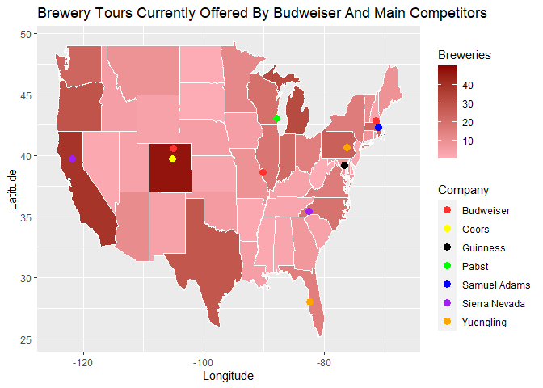<!-- -->

The map shows that Budweiser does not currently offer brewery tours in the South and the West Coast of the United States (and these areas have a fairly high density of craft breweries). 
So we will draft of proposal to address this.


```r
# Addresses of Budweiser breweries currently offering tours (taken from https://www.budweisertours.com/)
# and 2 Budweiser breweries that could start offering tours, 1 in Texas and 1 in California obtained from https://www.anheuser-busch.com/about/breweries-and-tours.html
budweiser_proposed_breweries_addresses <- tibble(singlelineaddress = c('2523 Frontage Rd, Fort Collins, CO', 
                    '221 Daniel Webster Hwy, Merrimack, NH',
                    '1200 Lynch St, St. Louis, MO',
                    '8169 Haskell Ave, Van Nuys, CA 91406',
                    '8772 Market Street Road, Houston, TX 77029'))
all_breweries_coordinates <- rbind(all_breweries_coordinates, data.frame(budweiser_proposed_breweries_addresses %>% geocode(address = singlelineaddress, method = 'census', verbose = TRUE), Company = "Budweiser"))
```

```
## Number of Unique Addresses: 5
```

```
## Passing 5 addresses to the census batch geocoder
```

```
## Querying API URL: https://geocoding.geo.census.gov/geocoder/locations/addressbatch
```

```
## Passing the following parameters to the API:
```

```
## format : "json"
```

```
## benchmark : "Public_AR_Current"
```

```
## vintage : "Current_Current"
```

```
## 
```

```
## Query completed in: 2.4 seconds
```

```r
# Plotting the breweries currently offering tours and the proposed breweries that could offer tours on the map
ggplot() + 
  geom_polygon( data=breweries_map, aes(x=long, y=lat, group=group, fill = n), color="white", size = 0.2) +
  scale_fill_continuous(name="Breweries", low = "lightpink1", high = "red4",limits = c(0,50), breaks=c(10,20,30,40), na.value = "darkgrey") +
  geom_point(data=all_breweries_coordinates, aes(x=long, y=lat, group=Company, color=factor(Company)), size=3) +
  scale_color_manual(name = "Company",
                     values = c("Budweiser" = "firebrick1",
                                "Coors" = "yellow",
                                "Samuel Adams" = "blue",
                                "Pabst" = "green",
                                "Guinness" = "black",
                                "Yuengling" = "orange",
                                "Sierra Nevada" = "purple")) +
  labs(title="Proposed Additional Budweiser Brewery Tours In Texas And California", x = "Longitude", y = "Latitude")
```

<!-- -->

Our proposal is to reconfigure 2 of the existing Budweiser breweries to offer public tours:  
  - The Budweiser brewery in Houston TX  
  - The Budweiser brewery in Van Nuys, CA (in the suburbs of Los Angeles)  

This proposal would give us a good coverage of the continental US States for breweries that offer public tours and help us better compete in areas that have a high density of craft breweries.
Also, the proposed public tour in California would compete against a public tour offered by Sierra Nevada.
And the proposed public tour in Texas would cover an area where none of our main competitors offer public tours.

  
